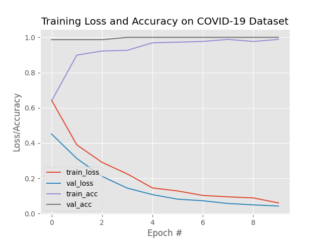

# Tabular Image to CSV:-

## Prerequisites :-

* [tensorflow2.0]()
* [OpenCV]()
* [sklearn]()
* [Matplotlib]()
* [Pandas]()
* [Imutils]()


### Download Data:

For Covid-19 chest xray Images
(Download Images folder by using below command and also download metadata.csv)
```
svn checkout https://github.com/ieee8023/covid-chestxray-dataset/trunk/images
```
For Normal chest xray Images(Download dataset and extract only normal images)
```
https://www.kaggle.com/paultimothymooney/chest-xray-pneumonia
```
### Extract Data:

For Covid-19 chest xray Images
```
python3 preprocessing_covid.py
```
For Normal chest xray Images
```
python3 preprocessing_normal.py
```

##Project Structure:-

* [model.h5]() :- Trained model.
* [inference.py]() :- Inference file.
* [training_script.py]() :- training file.


## Python command  to train model

```
python3 training_script.py -d data
```

## Python command for inference(replce data with your test data)

```
python3 inference.py -d data -m model.h5
```

### Training Results:-



### Test Results:-


    
